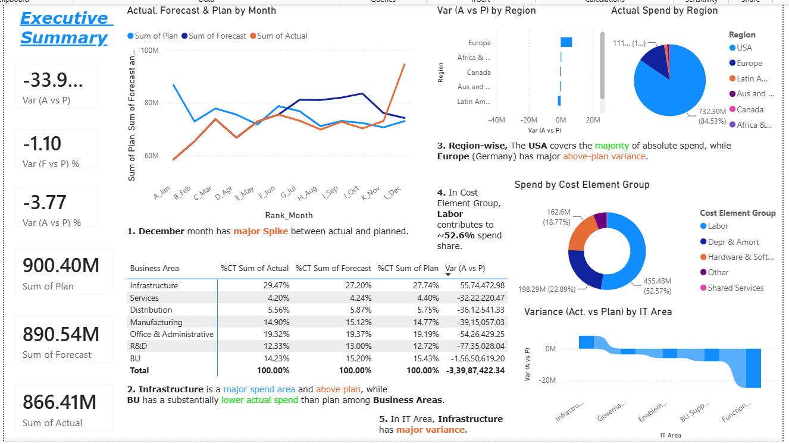

# IT_Expenditure_Analysis - Power BI

## Project Overview

This project analyzes **IT expenditure across business areas, regions, IT areas, and cost categories** using Power BI.

The dashboard compares **Actual, Forecast, and Plan** spending to identify budget variances, major cost drivers, and areas requiring further investigation.

## Objectives

* Analyze IT spending across regions and business areas
* Compare Actual vs Plan vs Forecast
* Identify major cost drivers and budget variances
* Provide interactive drilldowns for management analysis

## Data & Tools

**Data Source:** Excel
**Tools:** Power BI, Power Query, DAX

Key fields include:

* Business Area
* Region & Country
* IT Area & IT Sub Area
* Cost Element Group & Sub Group
* Actual, Forecast & Plan

## Key Insights

* Total Actual Spend: **866.41M**
* Total Plan: **900.40M**
* Actual vs Plan: **-33.99M (-3.77%)**
* **Labor** represents approximately **52.6%** of actual spend.
* **Infrastructure** is approximately **3.4% above plan**.
* **Europe** is approximately **6.8% above plan**.
* December shows a significant above-plan variance of approximately **21.5M**.

## Dashboard

The Power BI dashboard includes:

* KPI cards for Actual, Plan and Forecast
* Monthly spending trends
* Regional and business-area analysis
* Cost-element analysis
* Variance analysis
* Interactive slicers and drilldowns

## Repository Structure

```text
IT-Expenditure-Analysis/
│
├── README.md
├── IT Expenditure dataset.xlsx
├── IT Expenditure Analysis.pbix
└── IT Expenditure Analysis Images
```
## Dashboard Preview

### Executive Summary


## Conclusion

The dashboard provides an interactive view of IT expenditure and helps identify significant budget variances and key cost drivers for further investigation.

**Author:** Rasika Yadav
